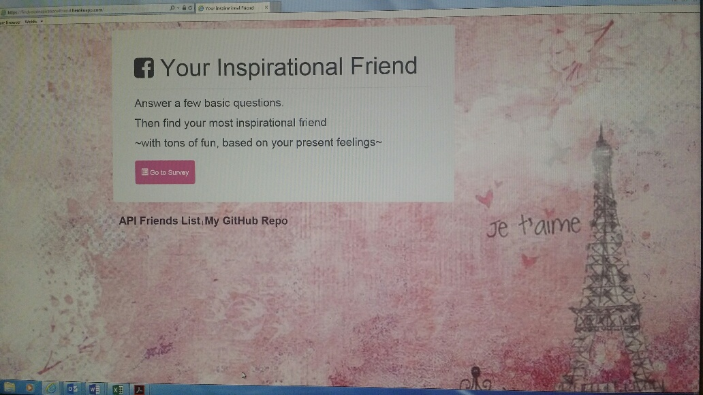
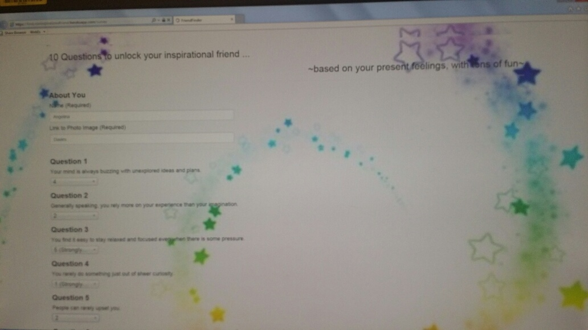
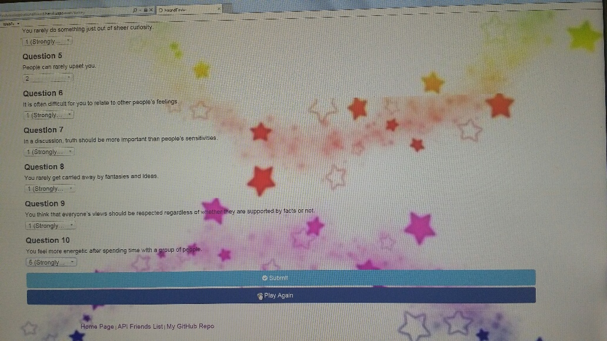

# Your Inspirational Friend app

Built in node.JS & using Express Servers.

Deployed in HEROKU: https://findyourinspirationalfriend.herokuapp.com/

### Highlights

Your Inspirational Friend app stems from thecompatibility-based "Friends Finder" application. Built in node.JS and Express Servers, the theme of the app is "find your inspirational friend, based on your present feelings". 

### Key Concepts

The app takes in the user's input through a questionnaire of 10 fun questions, and then compares the score answers with those existing in the API. Afterwards, the app displays the name and picture of the inspirational friend with the best overall match. 

#####The app requires node.JS, including npm dependencies:

- Node.js
- body-parager NPM Package - https://www.npmjs.com/package/inquirer
- express NPM Package -https://www.npmjs.com/package/express
- path NPM Package - https://www.npmjs.com/package/path

In your terminal run node server, which shall return the PORT: 5000. To start the app open your local browser and type http://localhost:5000/

---

### HOME Page

The Home Page gives the user the option to take the survey to match up to match up to your best inspirational friend in the present moment, based on your current feelings. The home page provides two more links, located at the bottom of the page: (1)the API Friends List and (2)My GitHub Repo.

### SURVEY Page

The Survey Page is based on 10 questions, each of them giving the user the option to select the most agreeable choice: 1) Strongly
disagree, 2) Slightly disagree, 3) Neither agree or disagree, 4) Agree, 5) Strongly agree.

Once the user hits the submit button ...

#### Then a modal pops up with the users best match. The app compares the user's responses with the pre-filled inspirational friends answers of the array, displaying the inspirational character with the smallest difference.

> 

#### The user have the option to 'Play Again'. Furthermore, the Survey Page provides three links, located at the bottom of the page: (1)Home Page (2)API Friends List and (3)My GitHub Repo.

---

### Future enhancements

 * Enhance the code to avoid repetition / Dry the code.

---

* **by Angelina Davies – July 2018** - *HTML/CSS/JS/Node.js*- [Angelina Davies](https://github.com/angelyna)
